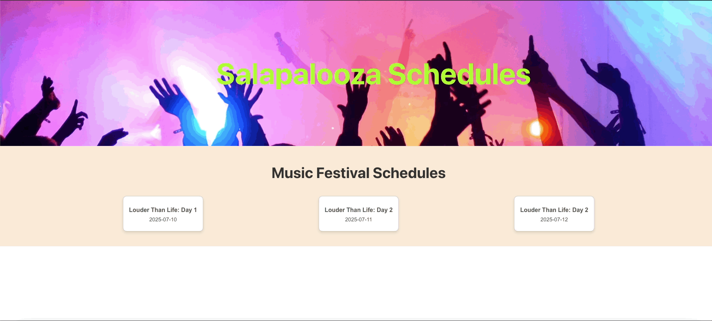

# Salapalooza

## Description
This application is has a functionality focus for admins viewing the details of schedules submitted, the ateendee who created that schedule, and the shows in which they are interested in. Aditionally it allows the admin to edit the users information as needed.

## Features
- A homepage that lists all the schedules that have been created and are in the system. On this page the admin can choose which schedule they want to see more details of. 
- A schedule details page to view additional details of what the users personal schedule is. On this page the admin can see the users personal information, a list of cards that contain the shows and show information, and the ability to delete the show from the users itunerary. 

The administrative application is built using React and leverages React Router to allow the user to navigate between pages. Futher, this app communicates to a back end rails application to pull down the required information. 

## App Demo

 ### Team Members
#### Kaelin Salazar
- [LinkedIn Profile](https://www.linkedin.com/in/kaelin-salazar/)
- [GitHub Profile](https://github.com/kaelinpsalazar)

 #### Links
- [Github FE Repo](https://github.com/kaelinpsalazar/final-music-fe)
- [Github BE Repo](https://github.com/kaelinpsalazar/music_festival_app)
